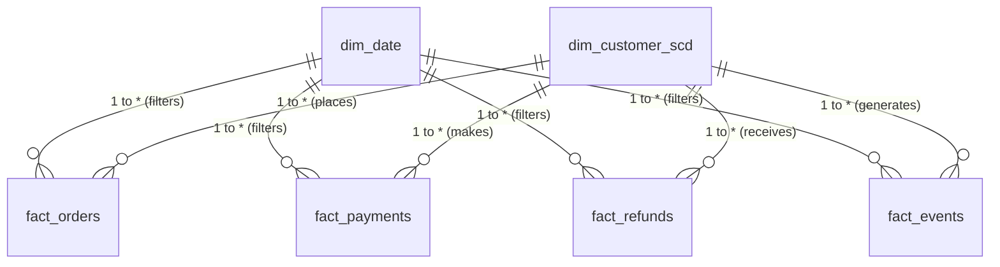

```mermaid
erDiagram
    dim_date ||--o{ fact_orders : "1 to * (filters)"
    dim_date ||--o{ fact_payments : "1 to * (filters)"
    dim_date ||--o{ fact_refunds : "1 to * (filters)"
    dim_date ||--o{ fact_events : "1 to * (filters)"

    dim_customer_scd ||--o{ fact_orders : "1 to * (places)"
    dim_customer_scd ||--o{ fact_payments : "1 to * (makes)"
    dim_customer_scd ||--o{ fact_refunds : "1 to * (receives)"
    dim_customer_scd ||--o{ fact_events : "1 to * (generates)"
```