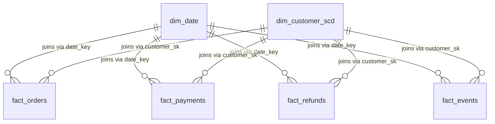

```mermaid
erDiagram
    dim_date ||--o{ fact_orders : "joins via date_key"
    dim_date ||--o{ fact_payments : "joins via date_key"
    dim_date ||--o{ fact_refunds : "joins via date_key"
    dim_date ||--o{ fact_events : "joins via date_key"

    dim_customer_scd ||--o{ fact_orders : "joins via customer_sk"
    dim_customer_scd ||--o{ fact_payments : "joins via customer_sk"
    dim_customer_scd ||--o{ fact_refunds : "joins via customer_sk"
    dim_customer_scd ||--o{ fact_events : "joins via customer_sk"
```